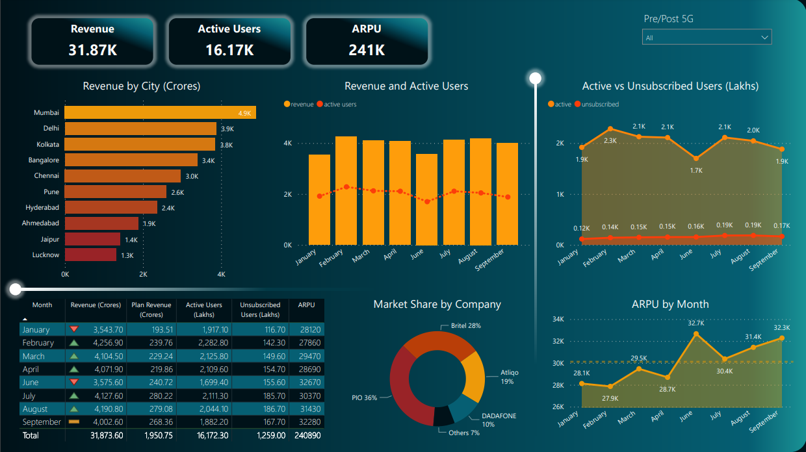

#  Azure Static Web Apps
## 1. Introduction
### 1.1	Overview
This is a machine learning notebook covering a prediction model to be used as a reference for other data scientists. The workflow is based on the following:
- Notebooks: A set of notebooks for building ml model.
- Github Codespace (devcontainer & Dockerfile)
- CICD pipeline for deploying web apps to Azure

## 2 Logical Architecture
### 2.1	Logical System Component Overview

- Data gets pulled from SQL to AWS Sagemaker Studio lab for EDA and model building.
- Building ML and DL models and export out for a later consumption (ML/DL as service via API).
- Notebook, IaC and ML models.
- Github action builds Azure Static Web app and Azure Function using Bicep.
get pushed to github repo.
- Model gets invoked via API call powered by Azure Function.
- The logic apps triggers the function every 2 minutes to keep the Function warm. (Avoiding a coldstart)
- The end users can consume ML as a service via Webapp.

## 3 Power BI Dashboard for Visualization

## 4 Azure Static Web App for ML Prediction Demo
Link: [Web Application Demo](https://white-water-02d382d10.2.azurestaticapps.net)

## 5 MS Docs Link
Ref: [MS Docs: Static Web Apps Hosting Plans](https://learn.microsoft.com/en-us/azure/static-web-apps/plans)

Ref: [MS Docs Static Web Apps with Function Integration](https://docs.microsoft.com/en-us/azure/static-web-apps/functions-bring-your-own/)